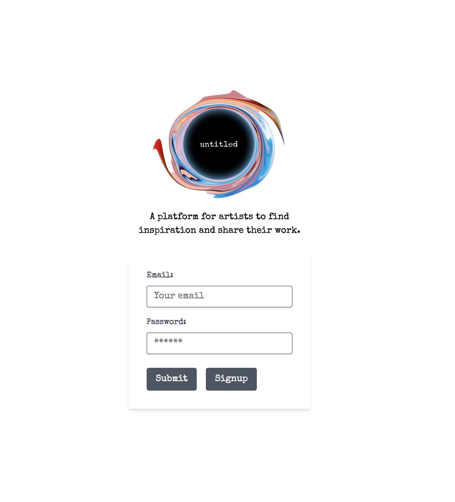

# Untitled

## Description

A platform for artists to find inspiration and share their work. 
- Users can create a profile and upload a work of art to share it with the world. 
- Users can also browse artwork that has been uploaded to the app, leave comments, and sell/purchase pieces.

## Table of Contents 

- [Installation](#installation)
- [Usage](#usage)
- [Credits](#credits)
- [License](#license)

## Installation

- If writing locally, run npm i and then run npm run develop. The app should then launch to localhost3000.
- If accessing via Heroku, follow this link https://untitled-art-app-b560d4f5fa59.herokuapp.com/

## Usage

- Users can go to their profile to upload new pieces of art once they login.
- Users can browse art by clicking on artist or art by medium.
- Screenshot:

## Credits

- [Profile Page Starter Kit](https://www.creative-tim.com/learning-lab/tailwind-starter-kit/documentation/profile)
- [useNavigate] (https://www.makeuseof.com/redirect-user-after-login-react/)
- [date-fns] (https://date-fns.org/v2.22.1/docs/format)
- [stripe-docs] (https://stripe.com/docs/checkout/quickstart)

- The Vite PWA documentation was very helpful to understand how to configure our page into a progressive web app. Here is a link for the webpage: https://vite-pwa-org.netlify.app/guide/.
- Used the tutorial 'Coding Shorts: Using the Vite PWA Plug-in' by Shawn Wildermuth to get started with the process, available here: https://www.youtube.com/watch?v=YSGLw4T8BgQ.
- We learned about favicons from an article titled 'What Is a Favicon, Why Is It Important, and How Do I Add One?' by Jay Kang, available here: https://www.seoptimer.com/blog/what-is-a-favicon/.
- The following site helped muse convert an image into a favicon with all the necessary files: https://favicon.io/favicon-converter/.
- We were able to make an image with a transparent background through Adobe Express: https://www.adobe.com/express/feature/image/transparent-background.

Collaborators
- Calvin Roberts 
    - https://github.com/croberts27
- Alex Vega
    - https://github.com/vlexaega
- LeAnne Branch
    - https://github.com/branchwag
- Danielle Cavallo
    - https://github.com/daniellecavallo
- Samantha Shrauner
    - https://github.com/Flying-S-Ranch

Third-party assets  
- Tailwind Elements: https://www.npmjs.com/package/tw-elements

Thank you to the following tutorials which helped with our project:
- Image Carousel: https://www.youtube.com/watch?v=XJSOgV4VELk&ab_channel=YourCodeLab
- Product Display: https://www.youtube.com/watch?v=VqAFrHdOA0w&ab_channel=Dojcinovic

## License

- MIT License
    - https://mit-license.org/
        - The MIT License is a permissive free software license originating at the Massachusetts Institute of Technology. As a permissive license, it puts only very limited restriction on reuse and has, therefore, an excellent license compatibility.

## Features

- Artists can easily share their work through creating their own personal profile / signing up.
- Artists have the ability to upload their work and sell it.
- Artists can recieve feedback within the form of "comments" per each piece of art.
- Artists has the ability to have comment section disabled if they choose.
- Users can go to their profile to upload new pieces of art once they login.
- Users can browse art by clicking on artist or art by medium.
